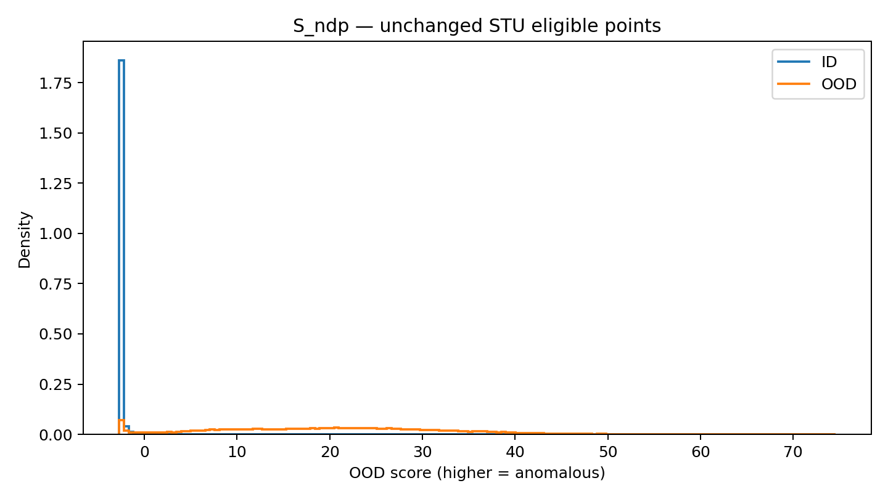
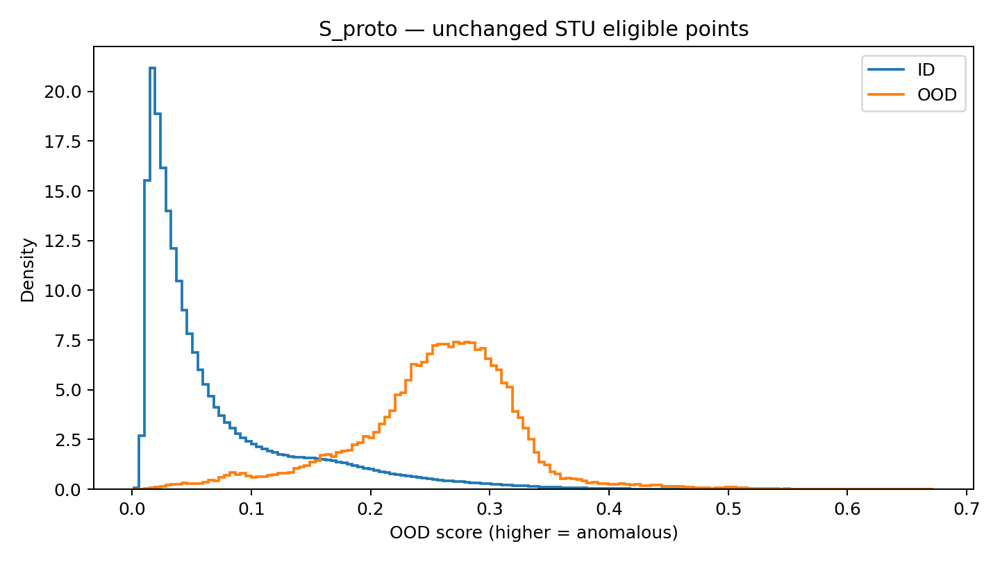
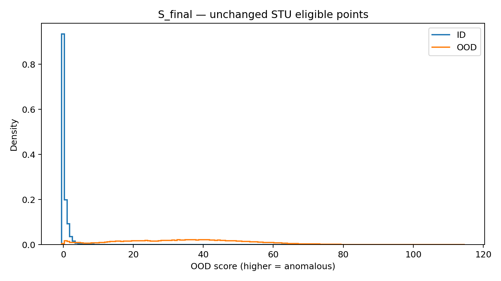

# V10：NDP + Prototype 完整实验报告

实验已于2026年9月15日11:32:00完成。所有阶段退出码为0，8659帧预测覆盖完整。原第六轮 NDP 三项 OOD 指标重现一致；没有重新训练、没有调整alpha、没有加入V08/V09。

本轮结果表现为：FPR95降低、AUROC小幅提高、AP小幅下降。保留为独立实验结果，尚不足以宣布全面优于或替换第六轮基线。

| 实验 | OOD分数 | AUPRC/AP↑（%） | AUROC↑（%） | FPR95↓（%） | mIoU*（%） |
|---|---|---:|---:|---:|---:|
| Round6 Baseline | S_ndp | 74.553207 | 99.359957 | 1.447267 | 3.437569 |
| Prototype-only诊断 | S_proto | 0.665150 | 95.041522 | 18.084882 | 3.437569 |
| V10 NDP + Prototype | S_final | 74.158468 | 99.427259 | 1.240967 | 3.437569 |

| V10−Round6 | 变化（百分点） | 方向 |
|---|---:|---|
| ΔAP | -0.394738 | 下降 |
| ΔAUROC | +0.067302 | 提高 |
| ΔFPR95 | -0.206300 | 改善；相对降低14.25% |
| ΔmIoU* | 0.000000 | 原语义预测相同 |

*mIoU是本轮对相同冻结语义分支补算的诊断值。Round6历史没有记录mIoU；它不是官方STU语义基准结果。使用原PanopticEval及原代码中注释的语义导出方式，对现有STU语义映射计算19类均值，非ID映射忽略。三个方法共用原语义预测，没有用OOD分数改写标签。低mIoU在原NDP和V10中完全相同，不能归因于Prototype。
全量语义统计中road占可映射ID GT的84.80%；语义标注适用性和语义导出协议仍需要单独审计，不能仅凭这个补算值宣称语义能力退化。

## 分数分布与原因分析

原OOD计算器在8659帧中保留1960帧，统计193,792,470个ID点和87,499个OOD点。OOD比例仅0.04513%。帧过滤、距离2.5–50m、原始标签规则及TPR严格大于0.95的FPR取值方式均保持原实现。

| 分数 | ID均值 | ID标准差 | ID中位数 | ID P90 | ID P95 | OOD均值 | OOD标准差 | OOD中位数/P50 | OOD P10 |
|---|---:|---:|---:|---:|---:|---:|---:|---:|---:|
| S_ndp | -2.614005 | 0.545196 | -2.719266 | -2.534393 | -2.302465 | 19.871668 | 12.224992 | 19.959377 | 3.641341 |
| S_proto | 0.070379 | 0.069584 | 0.042065 | 0.174202 | 0.222243 | 0.254962 | 0.068792 | 0.262343 | 0.165075 |
| S_final | 0.250797 | 1.159754 | -0.125967 | 1.255044 | 1.948447 | 34.675571 | 17.996009 | 34.863253 | 10.759661 |

三个分数使用不同量纲；不能直接比较原始均值差的大小来判断改进，应结合排序指标和各自ID/OOD重叠情况。

实测：Prototype的ID P95=0.222243，而OOD P10=0.165075，说明较高ID分数与较低OOD分数存在重叠。Prototype-only虽有95.0415%的AUROC，但AP仅0.6652%、FPR95达到18.0849%。在极低OOD占比下，大量ID尾部点会影响精确率。

融合后，95%召回附近的ID误报率下降，但AP下降，说明本轮改变了不同阈值区域的排序表现；一个工作点改善不代表整条PR曲线改善。当前记录不足以将AP下降归因到某个特定类别或具体点群。

训练集单场景、单类单均值表示和类别覆盖不均可能限制Prototype的代表性，这是后续待验证的解释，而非本轮已证明的因果结论。未根据评估结果修改alpha、删除原型类别或追加调参实验。

| OOD最近Prototype类别 | 点数 | 占OOD比例 |
|---|---:|---:|
| bicycle | 35947 | 41.0828% |
| person | 29596 | 33.8244% |
| car | 10843 | 12.3921% |
| road | 6818 | 7.7921% |
| vegetation | 1951 | 2.2297% |
| pole | 852 | 0.9737% |

bicycle原型仅由1192个训练点构建，却是41.08%的OOD点的最近原型，值得在独立训练/校准数据上检查其代表性。最近类别只表示余弦相似度最大，不等于这些OOD点已经被判成ID，不能把最近类别比例直接称为该类误分类率。

## 配置、输入及验证记录

1. Round6冻结基线：`/root/autodl-tmp/NDP/research_versions/experiments/v06_baseline`。本实验从独立工作目录中相同的source_v06快照导入模型。
2. checkpoint：`/root/autodl-tmp/NDP/outputs/compare-bn-ema-b2-20260914-005611/training/epoch=9.ckpt`。SHA256：`78e53764b2bf210337646dd2134d375074552bf0a39f660473fe29fe959ffb07`。
3. 原NDP异常分数：`source_v06/models/mask4former.py`，`pixel_ood=(logsumexp(logits38)-logsumexp(logits19))*class_weight(logits38)+training_bias`。原始输出保留。
4. 特征接入：Sparse UNet后、Projector前的`point_features_head`，通过只读forward hook获取，不改网络参数。
5. 特征形状：`[N_voxel,128]`，使用原inverse_map对应回`[N_original,128]`；原始GT标签为`[N_original]`。
6. Prototype形状：`[19,128]`；17个有效类。bicyclist和parking没有训练样本，零行显式屏蔽。
7. 构建数据：实际ID train数据库898帧、scene206，106,329,999个有效ID点。每个原始点按其GT贡献，不使用体素代表点标签替代。
8. 用于Prototype或归一化统计的OOD/evaluation数据：NO。训练数据原有14,029个OOD点已过滤；Prototype采用原始特征均值后L2归一化，查询特征也L2归一化。
9. 重新训练：NO。全部39,672,034个参数冻结；backbone、loss、BN、optimizer、scheduler、原训练配置未更改。离线统计是原始训练帧的确定性推理视图，不运行随机训练增广。
10. V08：DISABLED；无模块导入/调用。
11. V09：DISABLED；无模块导入/调用。
12. alpha=0.5，在配置中设置；本轮无alpha扫描。
13. 固定ID训练集z-score：NDP mean=-2.667524274108, std=0.342625564251；Prototype mean=0.050592414210, std=0.057288122210；eps=1e-8。模型FP32，融合数值使用float64。
14. 三项单元测试及三帧烟雾测试通过。三帧原始NDP分数逐点误差0，全量原始NDP指标也重现一致。首次绘图依赖失败保留，修正为调用已有基础Python matplotlib后通过，未安装新依赖。
15–18. 三组完整指标及四项变化见上表。AP为原sklearn average_precision_score，不是梯形积分PR-AUC。
19. 两张RTX3090可见，仅使用GPU0，推理batch1/FP32。全量峰值allocated=2.4484GiB，峰值reserved=22.4941GiB；后者包含缓存，不能把前者当作整次进程显存需求。完成后两卡均0%/11MiB。
20. 实现新增9文件：V10_PROTOTYPE_AUDIT.md、README.md、config.json、prototype_module.py、run.py、evaluate.py、plot_histogram.py、pipeline.py、test_prototype.py。本次收尾只新增结果目录及校验清单，不修改已提交的实现文件。
21. Git分支：`exp/v10-ndp-prototype`，保留旧的conditional-combination V10提案；V06/V08/V09不覆盖。
22. 实现提交：`12ed4ff34d1b40d648a3dff3c762308c92db686e`。本报告随实验结束后的单次结果提交发布；最终结果提交SHA由Git历史及本地发布记录给出。

## 运行耗时与产物

| 阶段 | 开始（北京时间） | 结束 | 退出码 |
|---|---|---|---:|
| unit | 2026-09-15T09:55:29+0800 | 2026-09-15T09:55:31+0800 | 0 |
| smoke-forward | 2026-09-15T09:55:31+0800 | 2026-09-15T09:55:46+0800 | 0 |
| smoke-metrics | 2026-09-15T09:55:46+0800 | 2026-09-15T09:55:50+0800 | 0 |
| prototype-fit | 2026-09-15T09:55:50+0800 | 2026-09-15T10:06:06+0800 | 0 |
| full-inference | 2026-09-15T10:06:06+0800 | 2026-09-15T11:10:08+0800 | 0 |
| full-evaluation | 2026-09-15T11:10:08+0800 | 2026-09-15T11:32:00+0800 | 0 |

总计约1小时36分31秒：完整构建及归一化约10分16秒，推理64分02秒，评估21分52秒。

服务器运行目录：`/root/autodl-tmp/NDP/outputs/v10_ndp_prototype_20260915_095529`。
完整逐点分数及最近类别：`full/prediction/<scene>/<frame>.npz`，8659个文件。完整Prototype：`full/prototypes.pt`。这些数组不提交到GitHub。
本结果目录保留完整指标、归一化参数、Prototype类别统计、输入文件SHA清单、直方图、所有阶段日志、完成标记与旧版本完整性检查。原始完整结果表见`full/V10_RESULTS.md`。
第六轮原指标、源文件与checkpoint的外部SHA检查通过；研究主目录及V08、V09工作目录的历史完整性检查通过，见integrity-final-20260915.log。
没有启动后续训练，也没有恢复周期监控。按最新要求，后续遵循“本地/服务器修改验证，实验跑完后统一上传GitHub”。
